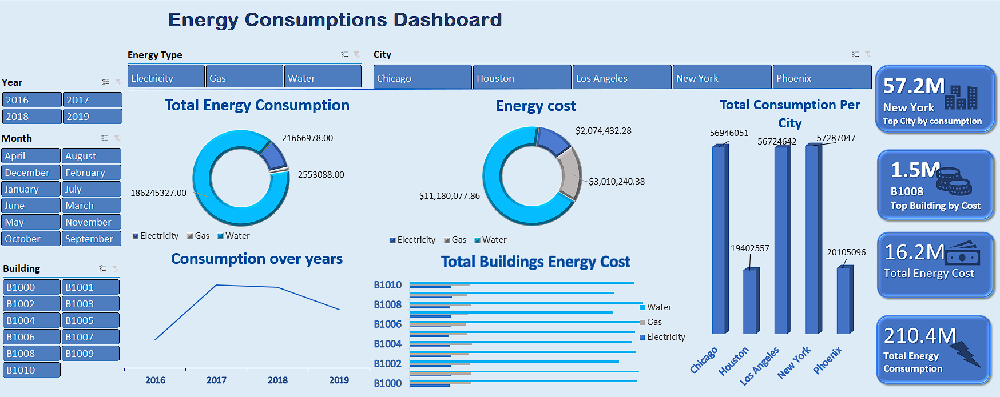

 # 📊 Energy Consumption Analysis

An interactive dashboard for analyzing energy consumption trends across different years, buildings, and energy types.  
Built using **Excel, Power Pivot, and Pivot Tables** to provide dynamic insights and visualizations.

## 📌 Dashboard Preview:

## 📢 Features:
- **📊 Interactive Dashboard:** Analyze energy trends across different dimensions.
- **📈 Power Pivot & Pivot Tables:** Used for dynamic aggregations and efficient data summarization.
- **📉 Visual Insights:** Charts and tables for clear data representation.
- **⚡ Energy Types:** Water, gas, and electricity consumption tracking.
- **🔍 Yearly Comparison:** Compare energy usage trends across different years.
- **🏢 Multi-Building Analysis:** Track and compare consumption in various buildings.

## 🚀 How to Use:
1. Download the Excel file from the repository.
2. Open the file in Microsoft Excel (2016 or later recommended).
3. Navigate to the dashboard tab to explore the insights.
4. Use filters and slicers to customize your view.

## 📬 Contact:
🔗 **LinkedIn:** [Amira Khater](https://www.linkedin.com/in/amirakhater/)  
📧 **Email:** Amira.Yousef.Khater@gmail.com  

 
 
